# My Game
Đây là một game đầu tiên của mình
## Mục lục

1. [Cài đặt](#cài-đặt)
2. [Demo](#demo)
3. [Nguồn tham khảo](#nguồn-tham-khảo)
4. [Ý tưởng](#ý-tưởng)
5. [Lời kết](#lời-kết)
6. [Liên hệ](#liên-hệ)

## Cài đặt

B1: Tải Visual Studio :
https://visualstudio.microsoft.com/fr/downloads/

B2: Dùng git clone toàn bộ repository về máy tính của bạn.

B3: vào visual studio tạo 1 project mới

B4: 

Ở cửa sổ windown explorer 

Chọn Add > Existing Item....

Chọn các file .h và .cpp mà bạn đã clone về.

B5: Cài đặt SDL

Hướng dẫn chi tiết:
https://www.youtube.com/watch?v=QQzAHcojEKg&list=PLhfAbcv9cehhkG7ZQK0nfIGJC_C-wSLrx&index=1

B6: chơi

## Demo

### Menu
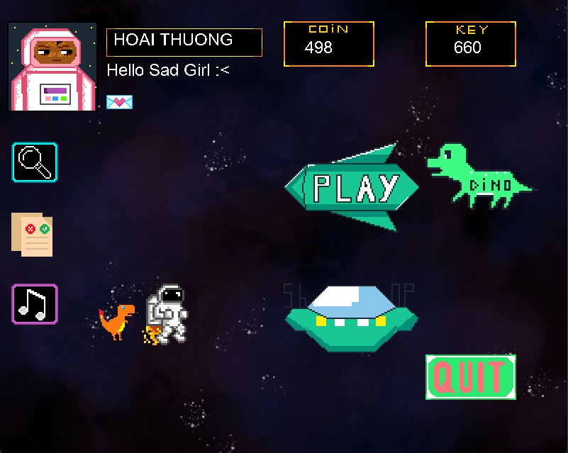

### GameState
dùng các nút mũi tên để di chuyển và space để bắn!

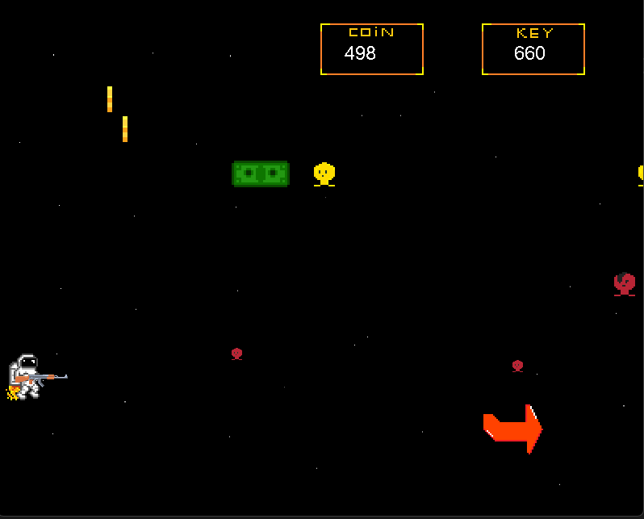

dùng các nút mũi tên để di chuyển

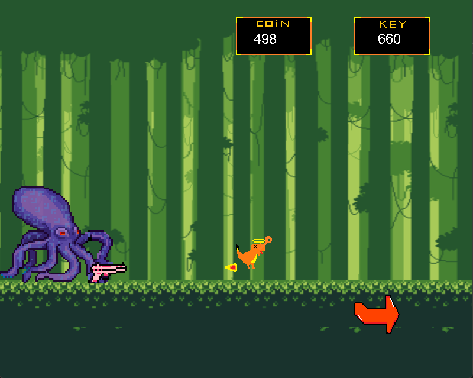

dùng các nút mũi tên để di chuyển

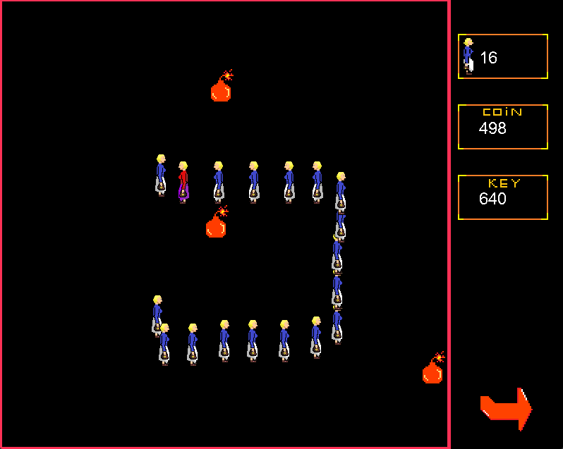

dùng các nút mũi tên để di chuyển và nút 1,2 để xuất chiêu

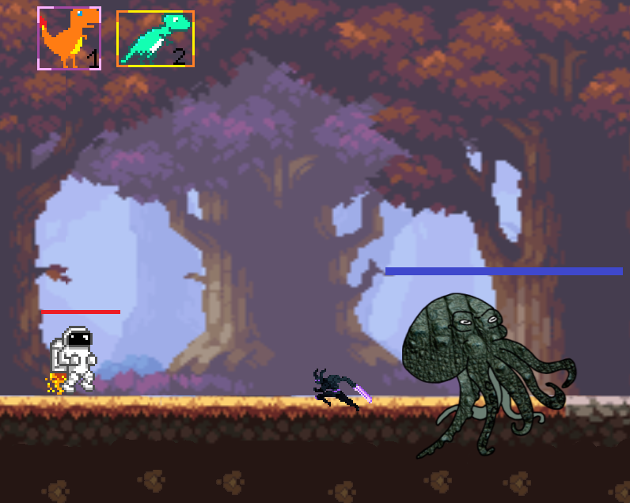

### Các chức năng khác
state bạn sẽ thấy nhiều nhất nếu chơi dở

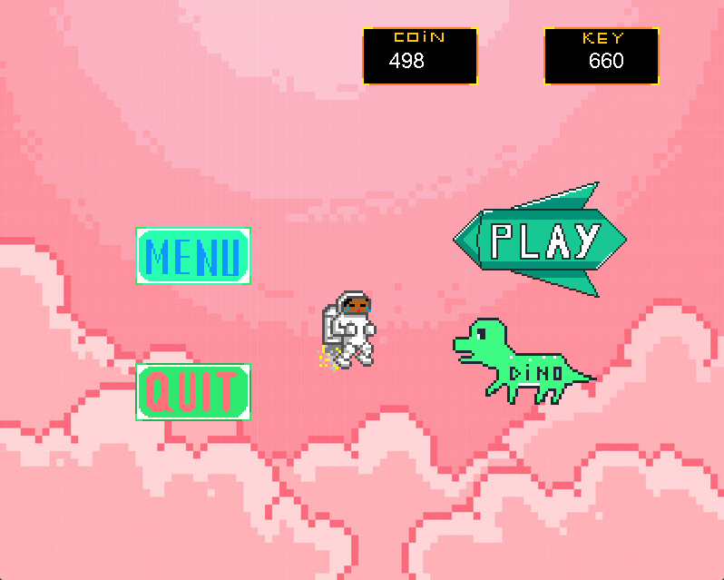

khỏi cần xem hướng dẫn vì mình hướng dẫn ở read me rồi

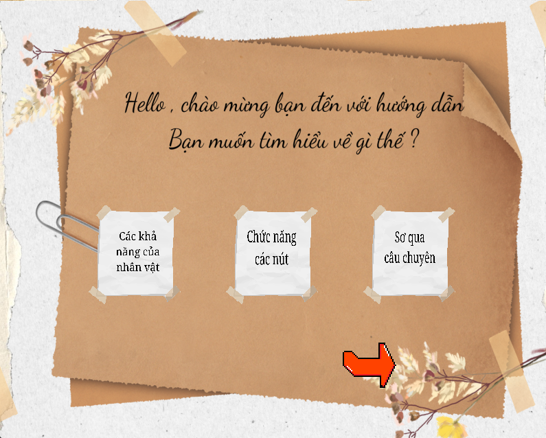

cốt chuyện chính, hơi xàm á, mình bịa để game hợp lý hơn

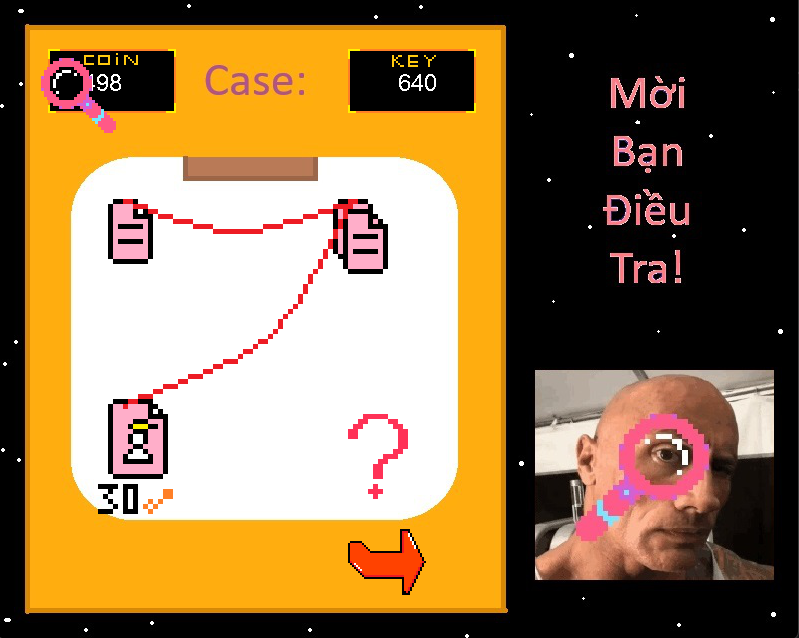

chọn nhạc

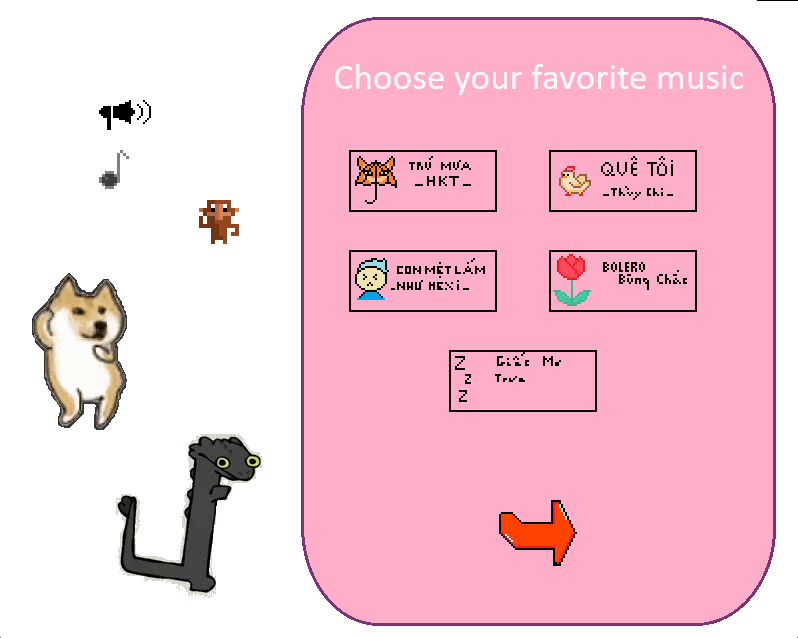

shopping

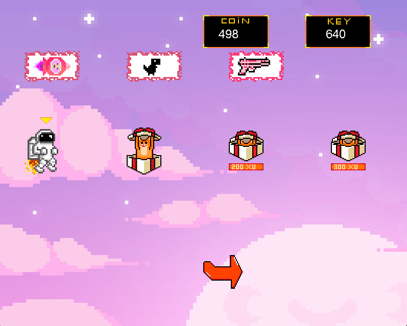

tên bạn là gì

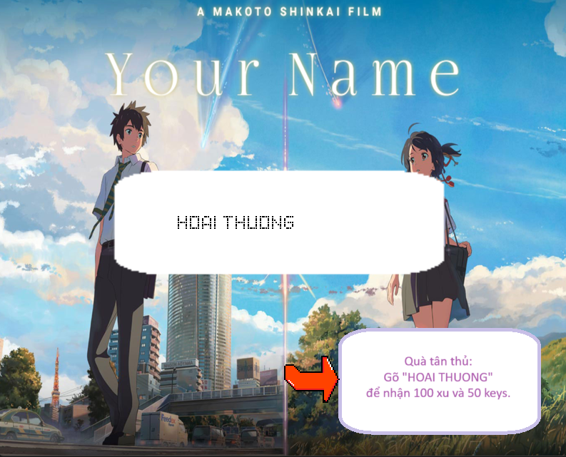

## Nguồn Tham Khảo
### sách SDL Game Development

một cuốn sách giúp mình rất nhiều để tạo game này

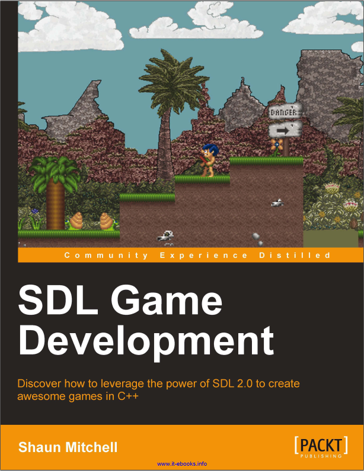
### youtube 

-let's make game : https://www.youtube.com/@CarlBirch (giọng chú này hay)

-video các anh chị bạn uet, xem rất cuốn

## Ý tưởng

Game khủng long mất mạng

The adventure of robin

Snake

## Lời kết
Mình thấy game còn nhiều thiết sót, chưa đủ vui, chưa đủ đẹp , nhưng mà deadline phải nộp rồi.

## Liên hệ
Email: thuongthuong051103@gmail.com
